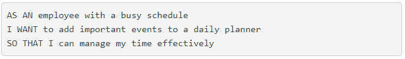
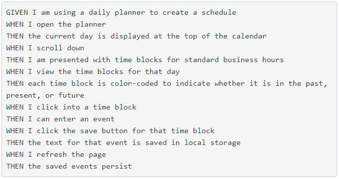
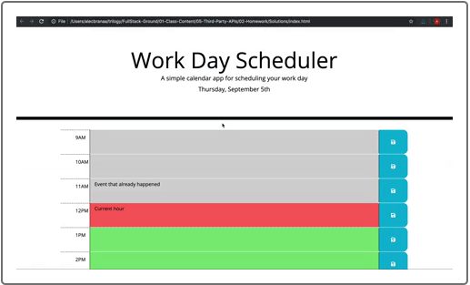

# Work Day Scheduler Starter Code

## User Story

## Acceptance Criteria

## Mockup

## Work Done

### Initial Program
* Updated index.html to support time block creation
* Created loadEvents() to act on load and update "p" element in header with today's date
* loadEvents() all prompts the createBlocks() to create the various time blocks throughout the day
* used momentjs to determine today's date, and the hour for every timeblock

### Edit Events